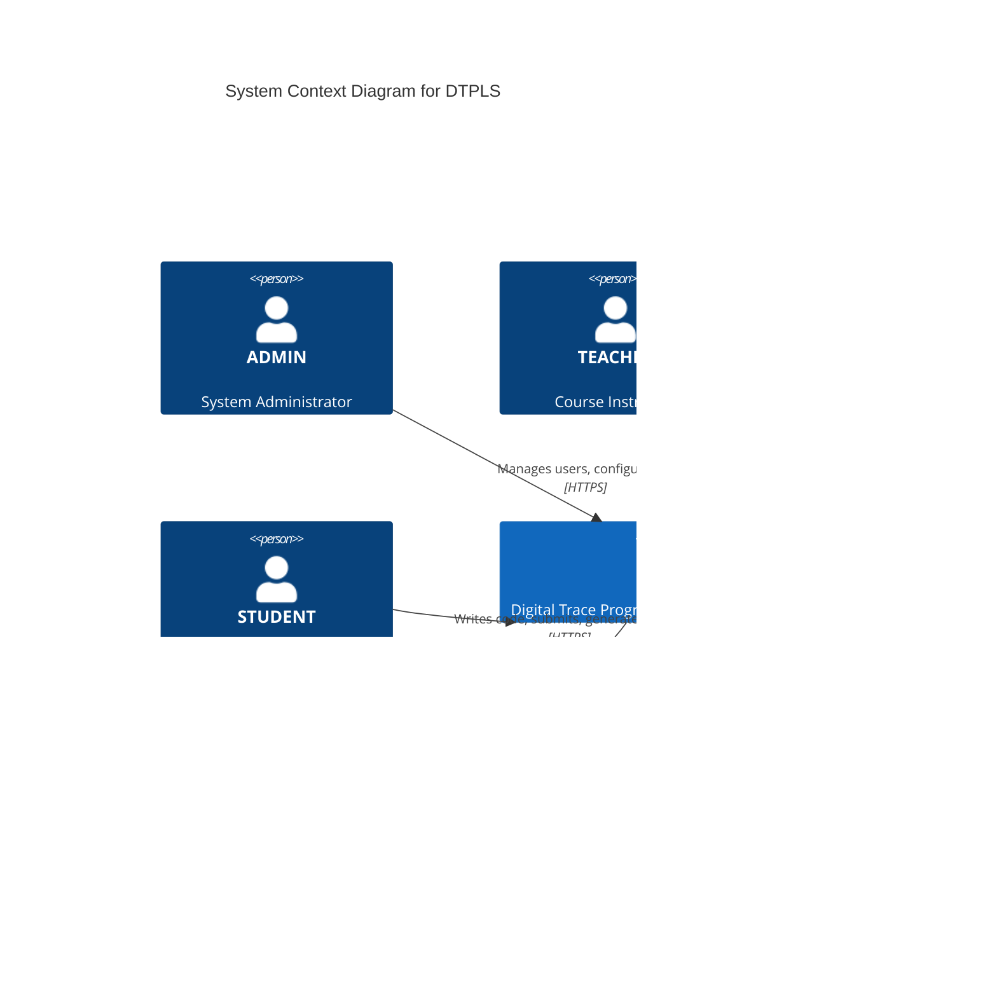
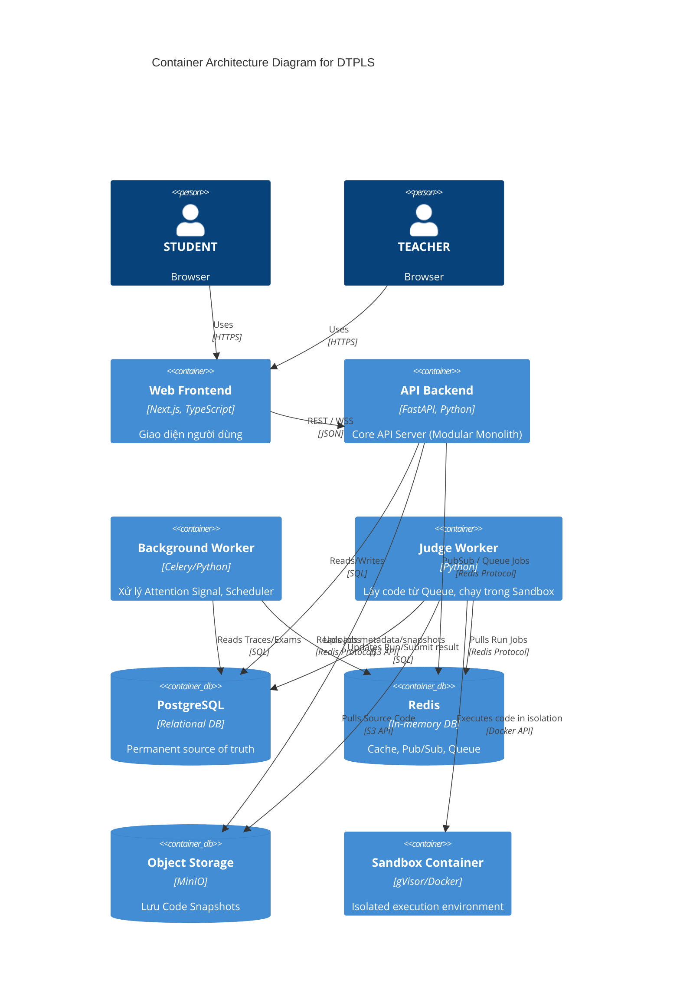

# 07 — SYSTEM ARCHITECTURE

## 1. System Context

Hệ thống Digital Trace Programming Learning System (DTPLS) tập trung vào việc quản lý quá trình học và thu thập dấu vết lập trình.

### 1.1 Actors
- **ADMIN:** Quản trị viên, cấu hình hệ thống.
- **TEACHER:** Giáo viên, tạo đề, theo dõi tiến độ, chấm bài.
- **STUDENT:** Học sinh, làm bài thi, code.

### 1.2 System Dependencies
- **Browser:** Client platform chính.
- **PostgreSQL:** Dữ liệu có cấu trúc.
- **Redis:** Transient state & WebSocket Pub/Sub.
- **MinIO/S3:** Object Storage cho snapshots.
- **Judge Environment:** Isolated sandbox cho code execution.

## 2. C4 System Context Diagram

## 3. Container Architecture

Hệ thống được chia thành các container độc lập về mặt triển khai nhưng gắn kết theo kiến trúc Modular Monolith ở API layer.

## 4. Distributed Integrity Observability

Metrics/logs dưới đây là operational evidence, không phải academic source of truth (PostgreSQL giữ role đó).

### 4.1 Trace Metrics
- `trace_ingest_batch_total`: Số lượng batch nhận được.
- `trace_ingest_batch_rejected_total`: Số batch bị reject (vd: do conflict).
- `trace_sequence_gap_total`: Số lượng sequence gaps phát hiện được.
- `trace_conflicting_duplicate_total`: Số lượng trace bị trùng sequence nhưng khác payload fingerprint.
- `trace_batch_retry_total`: Số lượng retry từ client.
- `trace_ingest_latency_seconds`: Thời gian xử lý batch.

### 4.2 Run/Judge Metrics
- `judge_queue_depth`: Số lượng job đang đợi trong Redis queue.
- `run_pending_stale_total`: Số lượng job kẹt ở PENDING quá timeout.
- `run_running_stale_total`: Số lượng job kẹt ở RUNNING quá timeout.
- `run_reenqueue_total`: Số lượng job được Reconciler đẩy lại queue.
- `run_duplicate_delivery_total`: Số lượng job bị Redis giao trùng lặp.
- `run_claim_conflict_total`: Số lượng failed atomic claims.
- `run_fencing_rejection_total`: Số lượng result bị reject do worker stale (không khớp execution_generation).
- `judge_execution_duration_seconds`: Thời gian chạy sandbox.
- `judge_worker_failure_total`: Lỗi infrastructure của worker.

### 4.3 Snapshot Metrics
- `snapshot_upload_failure_total`: Lỗi đẩy object lên MinIO.
- `snapshot_orphan_detected_total`: Số lượng orphan blob tìm thấy.
- `snapshot_orphan_cleanup_total`: Số lượng orphan blob đã dọn.
- `snapshot_orphan_cleanup_failure_total`: Lỗi khi dọn rác MinIO.
- `snapshot_blob_missing_total`: Blob bị mất trên MinIO dù có DB metadata.

### 4.4 Realtime Metrics
- `websocket_active_connections`: Số lượng kết nối WS hiện tại.
- `websocket_auth_rejection_total`: Số lượng auth fail.
- `websocket_revocation_disconnect_total`: Số lượng kết nối bị ép đóng do mất quyền.
- `websocket_reconnect_total`: Số lượng client kết nối lại.

### 4.5 Core Metrics
- API request latency, API error rate, PostgreSQL connection pool utilization, Worker failure rate, Redis availability, Storage availability.

### 4.6 Operational Alerts Candidates
- **A1**: Persistent trace sequence gaps (Gaps không được fill sau N phút).
- **A2**: Spike in conflicting duplicate TraceEvents.
- **A3**: Stale PENDING Runs above threshold.
- **A4**: Stale RUNNING Runs above threshold.
- **A5**: Judge queue backlog sustained above threshold.
- **A6**: Fencing rejection spike (`run_fencing_rejection_total` tăng cao).
- **A7**: Snapshot blob referenced by DB but missing.
- **A8**: Orphan cleanup repeatedly failing.
- **A9**: PostgreSQL connection saturation.
- **A10**: Elevated API error rate.

### 4.7 Log Correlation Fields
Mỗi log statement phải mang (nếu applicable): `request_id`, `session_id`, `run_id`, `job_id`, `execution_generation`. Không log: password, tokens, hidden testcases.
