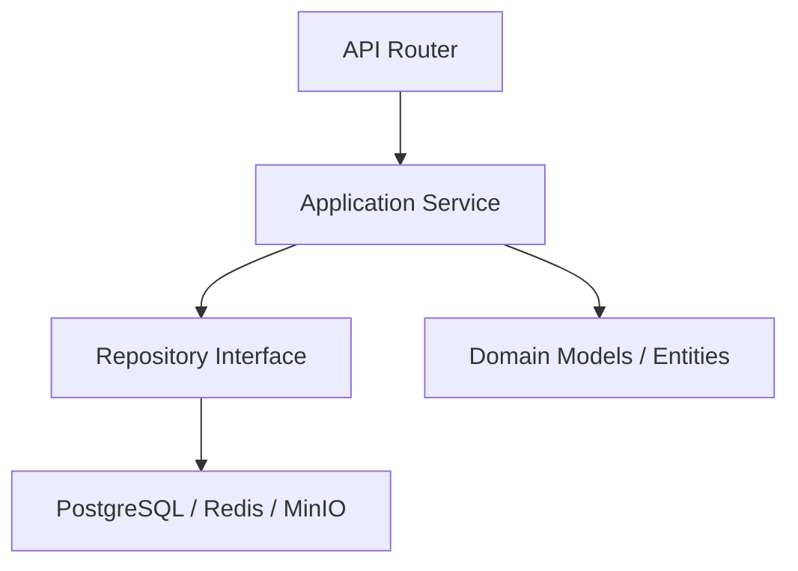

# 08 — COMPONENT ARCHITECTURE

## 1. Backend Modular Boundaries (FastAPI Modular Monolith)

Hệ thống tuân thủ kiến trúc Modular Monolith. Các module được tách biệt logic, có ranh giới rõ ràng.

### Core Modules:

1. **Auth & User Module**
   - **Responsibility:** Đăng nhập, phân quyền, profile.
   - **Owned entities:** User, Role, Session Token.
   - **Allowed deps:** Infrastructure.
   - **Forbidden deps:** Không gọi các module khác (Đây là leaf module).

2. **Class Module**
   - **Responsibility:** Quản lý lớp, học sinh.
   - **Owned entities:** Class, ClassMembership.
   - **Allowed deps:** User.

3. **Problem Module**
   - **Responsibility:** Ngân hàng đề, bài tập.
   - **Owned entities:** Problem, TestCase, ProblemBank.
   - **Allowed deps:** User, Class.

4. **Exam Module**
   - **Responsibility:** Lên lịch, quản lý kỳ thi.
   - **Owned entities:** Exam, ExamParticipation.
   - **Allowed deps:** User, Class, Problem.

5. **Session & Trace Module**
   - **Responsibility:** Ingest events, quản lý phiên làm việc.
   - **Owned entities:** CodingSession, TraceEvent.
   - **Allowed deps:** User, Problem, Exam.

6. **Run & Snapshot Module**
   - **Responsibility:** Execution, Code Snapshots, Submission.
   - **Owned entities:** CodeSnapshot, Run, Submission.
   - **Allowed deps:** Session & Trace, Exam.
   - **Interface:** Gửi job vào Redis Queue cho Judge Worker.

7. **Observation & Signal Module**
   - **Responsibility:** Teacher timeline, Attention signals, Annotations.
   - **Owned entities:** AttentionSignal, TeacherAnnotation.
   - **Allowed deps:** Tất cả modules trên (để tổng hợp dữ liệu).

### Layer Dependency Direction (Clean Architecture-inspired):
- **API Router** -> **Application Service** -> **Domain/Repository** -> **Infrastructure (DB/Redis)**
- Cấm business logic nằm trong API Router.

## 2. Judge Worker Component
- **Trách nhiệm:** Pull job từ Redis Queue, tải snapshot từ S3, build và run code qua Sandbox (Docker API / gVisor).
- **Isolation:** Không chia sẻ filesystem, RAM/CPU bị giới hạn chặt bằng cgroups.
- **Result:** Sau khi có output, cập nhật thẳng vào DB kết quả Run/Submit, đẩy message vào Redis PubSub báo Client.

## 3. Background Workers
- **Attention Signal Engine:** Chạy cron job mỗi 1-2 phút, tính toán gap time của active sessions để sinh IDLE_DETECTED nếu vượt ngưỡng.
- **Exam Status Scheduler:** Materialize status của Exam (chuyển sang ONGOING hoặc ENDED). Tolerance <= 60s.
- **Durable Job Reconciler:** Quét định kỳ bảng Run trong DB tìm các job kẹt PENDING hoặc RUNNING quá thời gian để re-enqueue (khôi phục dữ liệu bị mất trên Redis hoặc do Judge Worker crash).
- **Orphan Blob Cleanup:** Quét MinIO và DB định kỳ để dọn dẹp các Code Snapshot blob không có tham chiếu (do lỗi commit DB sau khi upload).
