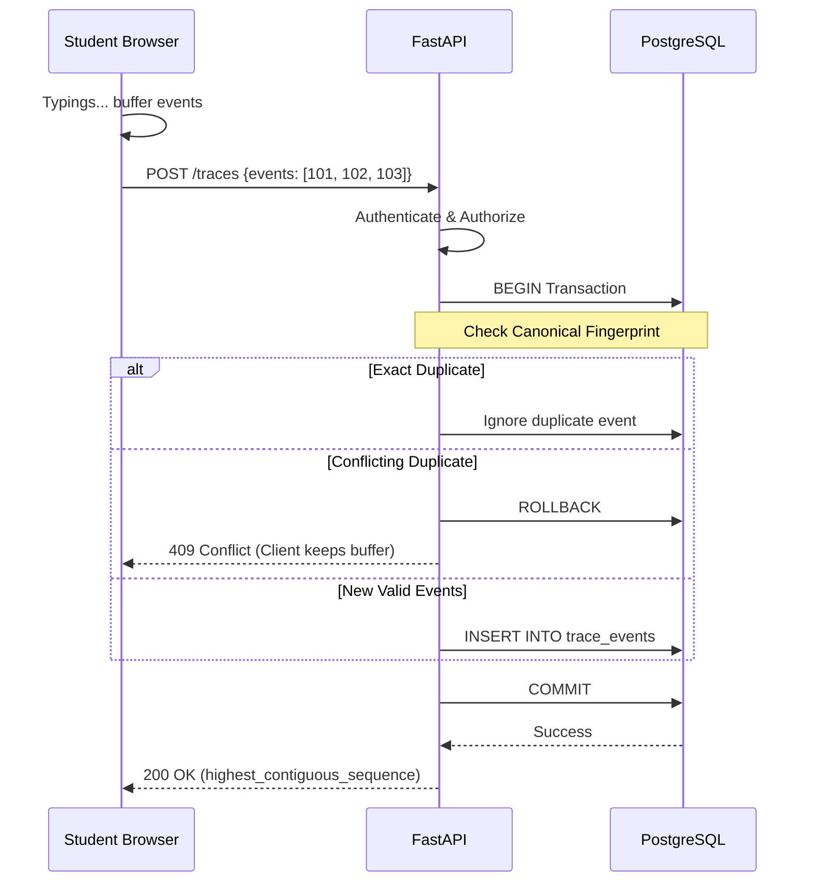
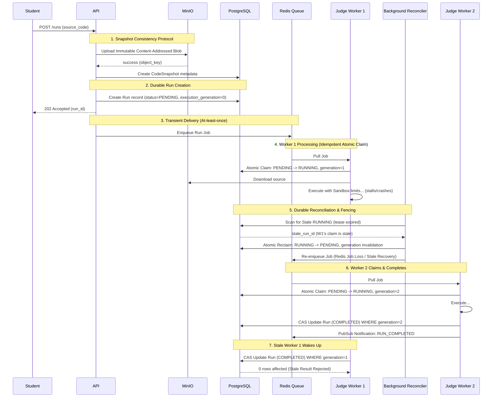
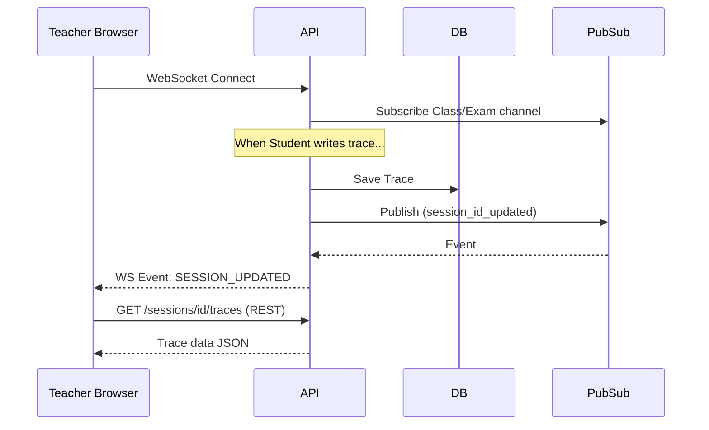

# 09 — DATA FLOW ARCHITECTURE

## 1. Digital Trace Ingestion Flow

- **Direct Durable Persistence:** API ghi thẳng batch vào PostgreSQL bằng All-or-nothing DB Transaction trước khi trả ACK (ADR-004).
- **Idempotency & Duplicate Protection:** API so sánh `(session_id, sequence_number)` và canonical payload fingerprint. 
  - **Exact Duplicate:** Payload giống hệt -> Trả 200 OK (Idempotent success), không insert mới.
  - **Conflicting Duplicate:** Payload khác nhau -> Reject toàn bộ batch (HTTP 409 Conflict). Client không được xóa buffer, phải reconcile.
- **Out of Order & Gaps:** Server lưu as-is. Tuy nhiên, Server phải detect gaps và trả về `highest_contiguous_sequence` hoặc `next_expected_sequence` trong payload của ACK. 
- **Client Buffer Release Rule:** Client CHỈ được xóa local buffer khi Server trả về ACK (200 OK) xác nhận đã lưu thành công các event đó.

## 2. Run / Submit Execution Flow

## 3. Exam Timeout Flow (Server-Authoritative)

Khi Exam hết giờ:
- Học sinh gửi POST `/submit` lúc `t = end_time + 1s`.
- API kiểm tra `end_time` (authoritative UTC).
- Mặc dù Exam.status chưa kịp cập nhật thành ENDED, API từ chối request -> `403 Forbidden` (Exam ended).
- Background Worker (chạy mỗi 30s) quét và finalize session: Tạo submission cuối từ snapshot gần nhất với `termination_actor = SYSTEM_EXAM_TIMEOUT`.

## 4. Realtime Observation Flow
- WebSocket KHÔNG stream raw source code (chỉ gửi tín hiệu ping/event id).
- Khi Teacher dashboard nhận ping qua WebSocket báo có session thay đổi, nó sẽ gọi REST API để kéo history/trace mới nhất.

