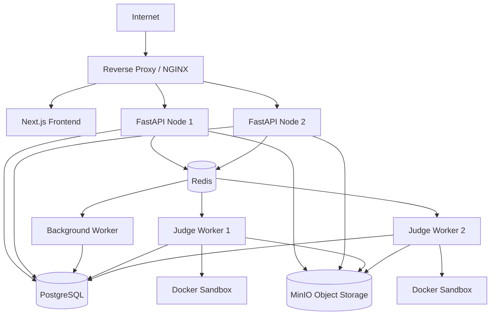

# 10 — DEPLOYMENT ARCHITECTURE

## 1. Deployment Topology

Kiến trúc triển khai V1 (sử dụng Docker Compose hoặc hệ thống tương đương như ECS/Swarm, không dùng K8s để giảm complexity).



### Components:
- **Reverse Proxy:** Terminate SSL, load balancing.
- **FastAPI Nodes:** Scale theo chiều ngang (stateless).
- **Judge Workers:** Scale theo chiều ngang độc lập với API. Tốn nhiều CPU.
- **PostgreSQL:** Lưu trữ core. Có backup định kỳ (RPO 24h, RTO 4h).
- **Redis:** Lưu transient pubsub, cache, celery broker.

## 2. Security / Trust Boundaries

```mermaid
graph TD
    subgraph Untrusted Zone [Browser / Internet]
        Student[Student]
        Teacher[Teacher]
    end
    
    subgraph DMZ [Reverse Proxy]
        NGINX
    end
    
    subgraph Trusted Backend Zone [Private Network]
        API[FastAPI]
        DB[(PostgreSQL)]
        Redis[(Redis)]
        MinIO[(MinIO)]
        WorkerBG[Background Worker]
    end
    
    subgraph Highly Untrusted Execution Zone [Isolated Sandbox]
        JudgeWorker[Judge Worker]
        Sandbox[Container Sandbox]
    end
    
    Student --> NGINX
    Teacher --> NGINX
    NGINX --> API
    API --> Trusted Backend Zone
    API --> JudgeWorker
    JudgeWorker --> Sandbox
```

### Nguyên tắc bảo mật
- Client input (như `server_timestamp`, `user_id`, `role`) **không bao giờ** được tin tưởng. Identity derive từ verified JWT Token.
- Học sinh không gửi được `start_time` hay `end_time` để lừa hệ thống. Server authoritative.
- Code Runner (Judge Worker) nằm trong vùng **Highly Untrusted**. Chỉ giao tiếp 1 chiều để kéo job và báo kết quả, code sandbox KHÔNG có quyền gọi ngược lại hệ thống nội bộ (Network = none trong container).
