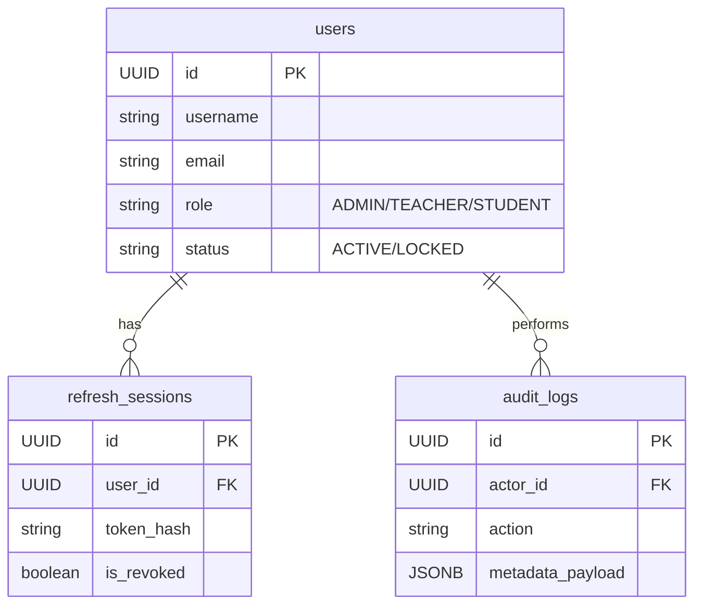
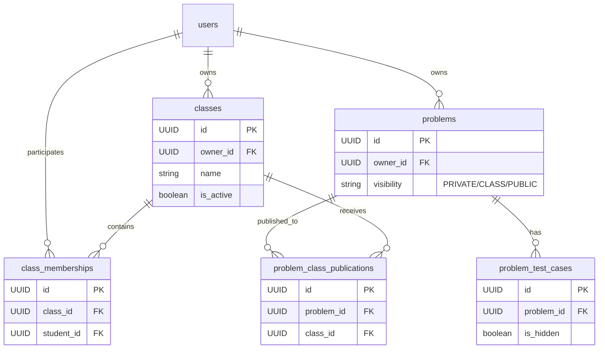
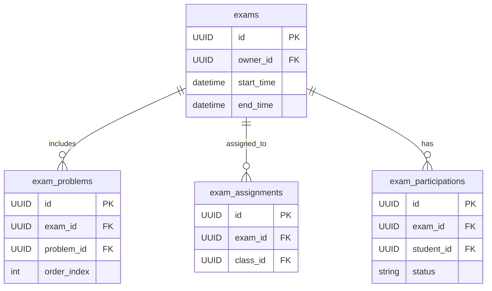
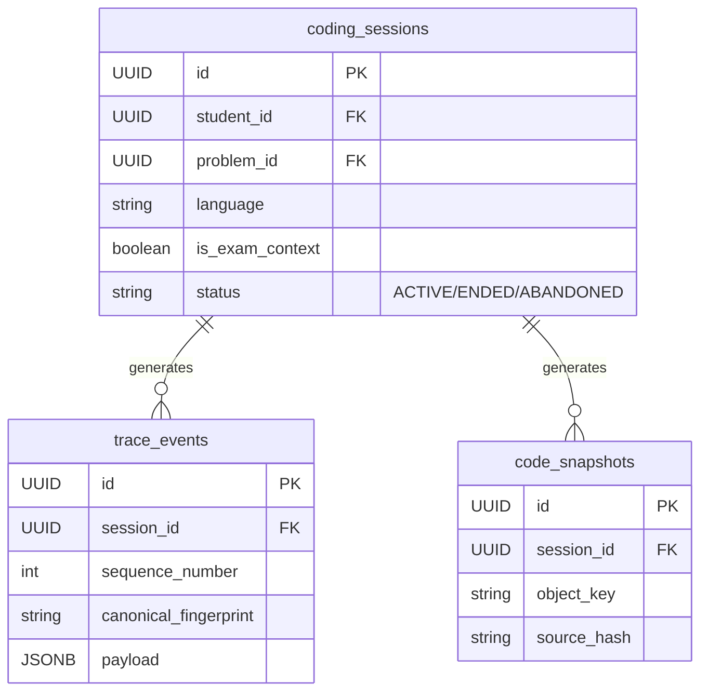
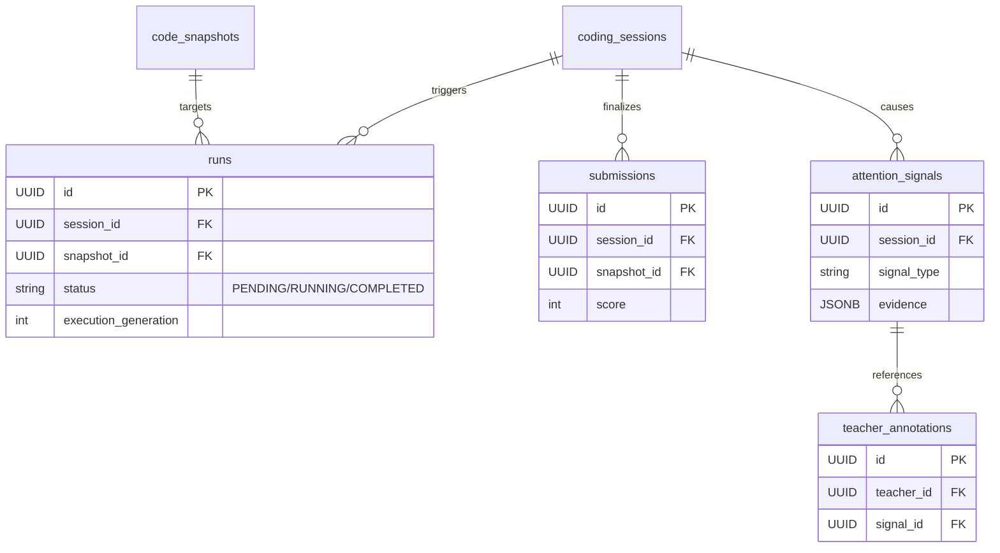

# 15 — DATABASE ERD

## 1. Identity & RBAC

```mermaid
erDiagram
    users {
        UUID id PK
        string username
        string email
        string role "ADMIN/TEACHER/STUDENT"
        string status "ACTIVE/LOCKED"
    }
    refresh_sessions {
        UUID id PK
        UUID user_id FK
        string token_hash
        boolean is_revoked
    }
    audit_logs {
        UUID id PK
        UUID actor_id FK
        string action
        JSONB metadata_payload
    }

    users ||--o{ refresh_sessions : has
    users ||--o{ audit_logs : performs
```

## 2. Academic Hierarchy

```mermaid
erDiagram
    users ||--o{ classes : owns
    classes {
        UUID id PK
        UUID owner_id FK
        string name
        boolean is_active
    }
    class_memberships {
        UUID id PK
        UUID class_id FK
        UUID student_id FK
    }
    users ||--o{ class_memberships : participates
    classes ||--o{ class_memberships : contains

    problems {
        UUID id PK
        UUID owner_id FK
        string visibility "PRIVATE/CLASS/PUBLIC"
    }
    problem_test_cases {
        UUID id PK
        UUID problem_id FK
        boolean is_hidden
    }
    problem_class_publications {
        UUID id PK
        UUID problem_id FK
        UUID class_id FK
    }
    users ||--o{ problems : owns
    problems ||--o{ problem_test_cases : has
    problems ||--o{ problem_class_publications : published_to
    classes ||--o{ problem_class_publications : receives
```

## 3. Exams & Participations

```mermaid
erDiagram
    exams {
        UUID id PK
        UUID owner_id FK
        datetime start_time
        datetime end_time
    }
    exam_problems {
        UUID id PK
        UUID exam_id FK
        UUID problem_id FK
        int order_index
    }
    exam_assignments {
        UUID id PK
        UUID exam_id FK
        UUID class_id FK
    }
    exam_participations {
        UUID id PK
        UUID exam_id FK
        UUID student_id FK
        string status
    }
    exams ||--o{ exam_problems : includes
    exams ||--o{ exam_assignments : assigned_to
    exams ||--o{ exam_participations : has
```

## 4. Coding Session & Trace

```mermaid
erDiagram
    coding_sessions {
        UUID id PK
        UUID student_id FK
        UUID problem_id FK
        string language
        boolean is_exam_context
        string status "ACTIVE/ENDED/ABANDONED"
    }
    trace_events {
        UUID id PK
        UUID session_id FK
        int sequence_number
        string canonical_fingerprint
        JSONB payload
    }
    code_snapshots {
        UUID id PK
        UUID session_id FK
        string object_key
        string source_hash
    }

    coding_sessions ||--o{ trace_events : generates
    coding_sessions ||--o{ code_snapshots : generates
```

## 5. Judge & Observation

```mermaid
erDiagram
    runs {
        UUID id PK
        UUID session_id FK
        UUID snapshot_id FK
        string status "PENDING/RUNNING/COMPLETED"
        int execution_generation
    }
    submissions {
        UUID id PK
        UUID session_id FK
        UUID snapshot_id FK
        int score
    }
    attention_signals {
        UUID id PK
        UUID session_id FK
        string signal_type
        JSONB evidence
    }
    teacher_annotations {
        UUID id PK
        UUID teacher_id FK
        UUID signal_id FK
    }

    coding_sessions ||--o{ runs : triggers
    code_snapshots ||--o{ runs : targets
    coding_sessions ||--o{ submissions : finalizes
    coding_sessions ||--o{ attention_signals : causes
    attention_signals ||--o{ teacher_annotations : references
```
